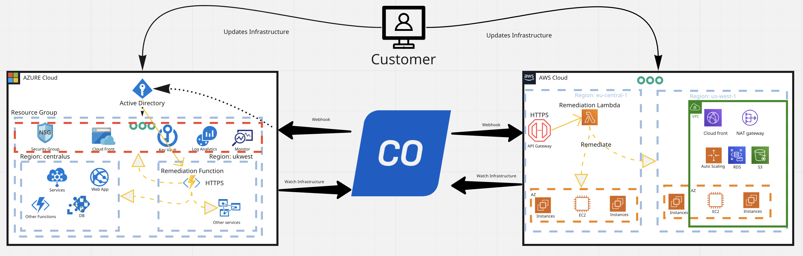

# Sophos Cloud Optix Remediation Functions

Automatically remediate security issues detected in your cloud environments with Sophos Cloud Optix using serverless functions.

* [How it Works](#how-it-works)
* [Getting Started](#getting-started)
    * [AWS](#aws)
    * [Azure](#azure)
    
* [Getting Help](#getting-help)
* [How to Contribute](#how-to-contribute)
* [Maintainers](#maintainers)
* [Remediation Functions List](#remediation-functions-list)

## How it Works
You can quickly and easily remediate security issues in your cloud environment using serverless automatic remediation, with functions provided for AWS and Azure.

Serverless functions are a simple way to create custom automatic remediation solutions based on Cloud Optix Alerts.

For example, when Cloud Optix detects and alerts on a security group allowing traffic from the whole of the public internet for SSH (port 22); action can be taken to automatically change this misconfiguration to instead allow access from a trusted IP address range only, safely removing the security risk exposure of the misconfiguration.

You can create your own automatic remediations by using the samples in this repo as a starting point.

## Getting Started

### AWS
1. Go to the AWS console -> Search for Lambda -> Create Function
2. Enter a Function Name.
3. Choose the Runtime as Python 3.9.
4. Architecture should be the default value.
5. Permissions – choose whichever bests suit your environment.
6. Leave the Advanced settings at the default values.
7. Choose “Create”
8. Go to: Configurations → General Configuration → Edit timeout to 15 mins(max)
9. Add a trigger
10. Select API Gateway
11. Set the API Type to REST API.
12. Set Security to API Key.
13. Choose Add
14. Go to: Lambda Function -> Configuration -> Triggers
15. Click on the API Gateway link
16. Go to Resources -> Actions, Create method POST
17. Attach the newly created lambda function to the method.
18. Click on Method Request -> Settings -> API Key Required and set to True.
19. Go to: Actions and Deploy API
20. Set Stage to default.
21. Go to Usage Plans -> In Details (Associated API Stages) -> Select you API and default stage and click (tick). 

You will now see the API URL and API key on lambda functions -> Configuration -> Trigger.

Copy those steps and create a [Cloud Optix Integration for webhooks](https://docs.sophos.com/pcg/optix/help/en-us/pcg/optix/concepts/IntegrateWebhooks.html) in the Cloud Optix console.

From the repository copy and paste the remediations which you want to be Auto remediated and add it to the lambda code.

`Main.py` is the main function which will run all the remediations so this should be attached to runtime settings → Handler of the newly created lambda.

### Azure

1. Go to the Azure portal.
2. Search for Function App.
3. Create -> Select resource group or create a new one.
4. Publish type code.
5. Choose Python 3.9.
6. Click on the Create button, after this you will see the button create function.
7. Click on Create function and push the code from repository provided, after editing which auto-remediations are needed. You can find this information in the [Azure documentation](https://docs.microsoft.com/en-us/azure/azure-functions/create-first-function-vs-code-python) as well as at the place where you will see the create function button.

NOTE: Please note that the alerts will be removed only after the sync has run post configuring the webhook in the corresponding environment. Sync runs after every hour(by default) or at preset frequency. One with superadmin and admin role can also manually trigger sync via cloud optix environments page.

## Getting Help
These scripts are supported by the Sophos community. Questions should be posted on the [Cloud Optix forum](https://community.sophos.com/sophos-cloud-optix/).

## How to Contribute
You are welcome to contribute to this project. You can [Fork](https://help.github.com/articles/fork-a-repo/) the project, make a well commented and clean commit to the repository, and create a [pull request](https://help.github.com/articles/about-pull-requests/).

## Maintainers
Cloud Optix Remediation Functions is an open-source project licenced under the Apache V2 licence. It is maintained by the Sophos Cloud Optix product team.

## Remediation Functions List
The table below lists the available automatic remediation functions.

| Provider | Service | Cloud Optix Rule | Description |
|----------|---------|------------------|------------------------------------|
|AWS| CloudTrail | AR-153 | Ensure the S3 bucket CloudTrail logs are not publicly accessible, CloudTrail buckets contain large amounts of sensitive account data and should only be accessible by logged in users. Set the S3 bucket access policy for all CloudTrail buckets to only allow known users to access its files.|
|AWS|CloudFront|AR-207|Detect the use of secure web origins with secure protocols for CloudFront. Traffic passed between the CloudFront edge nodes and the backend resource should be sent over HTTPS with modern protocols for all web-based origins. Ensure that traffic sent between CloudFront and its origin is passed over HTTPS and uses TLSv1.1 or higher.|
|AWS|RDS|AR-260|Ensure RDS snapshots are not publicly accessible. If RDS snapshots are public, any AWS account can restore from the snapshot and access your data. Therefore, as a best practice do not publicly share any RDS snapshots that contain sensitive information.|
|AWS|EC2|AR-309|Publicly shared AMIs. Accidentally sharing AMIs allows any AWS user to launch an EC2 instance using the image as a base. This can potentially expose sensitive information stored on the host. Convert the public AMI a private image.|
|AWS|EC2|AR-651|Ensure no security groups allow ingress from 0.0.0.0/0 to port 22, Security groups provide stateful filtering of ingress/egress network traffic to AWS resources. It is recommended that no security group allows unrestricted ingress access to port 22. Removing unfettered connectivity to remote console services, such as SSH, reduces a server's exposure to risk.|
|AWS|EC2 or RDS or ELB or ES|AR-1001|Flag resource(s) with public IP and Security Group with ingress from any source on any port. This check flags resources that are likely open to the world on all ports. If a resource is flagged on this list, review and change security group and/or other firewall rules to block traffic to all ports. Update the rules for the default security group to deny all traffic by default and only allow specific ports as needed.|
|AWS|Lambda|AR-1004|Ensure Lambda Functions are not publicly accessible. Publicly accessible Lambda functions can lead to data exposure. Ensure Lambda functions can only be invoked by trusted entities by implementing appropriate permissions. You can use the AWS lambda add-permission cli command to add a specific principal that needs access to the lambda function. Please refer to the permission model.|
|AWS|EC2|AR-1045|Flag Security Groups that allow inbound traffic on ports other than 80/443, attached to instances that are running, have a public IP, and are  in a subnet with NACLs that also allow inbound traffic on those ports. A common business case is to only allow inbound web (80/443) traffic from the internet. Traffic on other ports should be restricted to specific IPs, to reduce exposure in case of vulnerabilities in those services. In addition to Security Groups attached to instances, inbound traffic can be controlled with well defined custom Network Access Control Lists (NACLs) for each subnet, Update the rules for existing security groups and update the subnet’s Custom NACL.|
|AWS|EC2|AR-1044|Flag security-groups which are attached to running instances with public IP and have port open other than 80/443,A common business case is to only allow web (80/443) traffic from the Internet for external customers. The rest of the ports should be restricted to specific IPs to reduce exposure in case of vulnerabilities in those services,"Update the rules for existing security groups to deny all traffic by default, only allow 80/443 as needed and restrict other ports to specific IP blocks.|
|AWS|S3|AR-251|Ensure S3 buckets do not allow public read/list permission. S3 buckets can be configured to allow anyone, regardless of whether they are an AWS user or not, to read, create and delete objects. This option should not be configured unless there is a strong business requirement. There have been numerous security breaches as a result of world readable S3 buckets. In addition, global writes can allow man in the middle attacks. Therefore, both global reads and writes should be avoided as much as possible. Disable global all users policies on all S3 buckets. Also be very cautious about granting other AWS accounts these permissions.|
|AWS|S3|AR-252|Ensure S3 buckets do not allow public read/list bucket ACL permissions. S3 buckets can be configured to allow anyone to read and edit S3 bucket permissions/ACLs. This option should not be configured unless there is a strong business requirement. Allowing anyone to edit the bucket policy can result in bucket data getting exposed. Disable global all users policies on all S3 buckets. Also be very cautious about granting other AWS accounts these permissions.|
|AWS|S3|AR-267|Ensure S3 buckets do not allow public write permission. S3 buckets can be configured to allow anyone, regardless of whether they are an AWS user or not, to read, create and delete objects. This option should not be configured unless there is a strong business requirement. There have been numerous security breaches as a result of world readable S3 buckets. In addition, global writes can allow man in the middle attacks. Therefore, both global reads and writes should be avoided as much as possible. Disable global all users policies on all S3 buckets. Also be very cautious about granting other AWS accounts these permissions.|
|AWS|S3|AR-268|Ensure S3 buckets do not allow public write bucket ACL permissions. S3 buckets can be configured to allow anyone to read and edit S3 bucket permissions/ACLs. This option should not be configured unless there is a strong business requirement. Allowing anyone to edit the bucket policy can result in bucket data getting exposed. Disable global all users policies on all S3 buckets. Also be very cautious about granting other AWS accounts these permissions.|
|AZURE|Monitor|AZ-2251|Ensure that a Log Profile exists. Enable log profile for exporting activity logs.A Log Profile controls how your Activity Log is exported. By default, activity logs are retained only for 90 days. It is thus recommended to define a log profile using which you could export the logs and store them for a longer duration for analysing security activities within your Azure subscription. To verify and/or enable via Azure console, Go to Activity Log and ensure that a Log Profile is set.|
|AZURE|Security Centre|AZ-2052|Ensure that 'Automatic provisioning of monitoring agent' is set to 'On'. Enable automatic provisioning of the monitoring agent to collect security data. When Automatic provisioning of monitoring agent is turned on, Azure Security Center provisions the Microsoft Monitoring Agent on all existing supported Azure virtual machines and any new ones that are created. The Microsoft Monitoring Agent scans for various security-related configurations and events such as system updates, OS vulnerabilities, endpoint protection, and provides alerts.|
